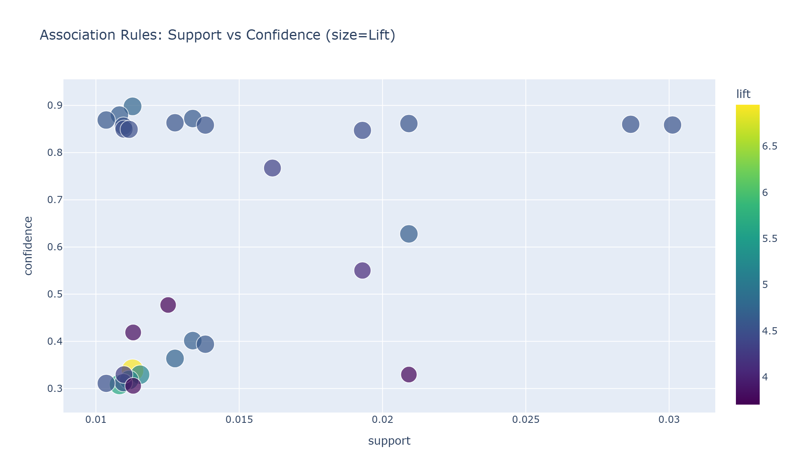
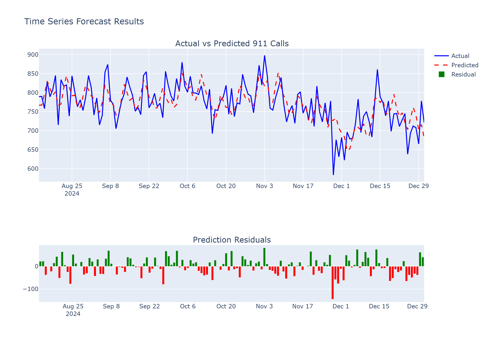
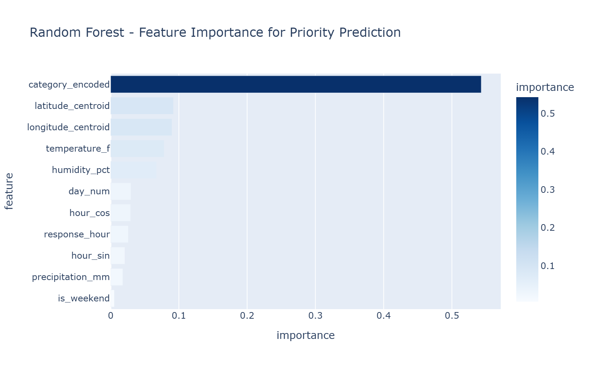
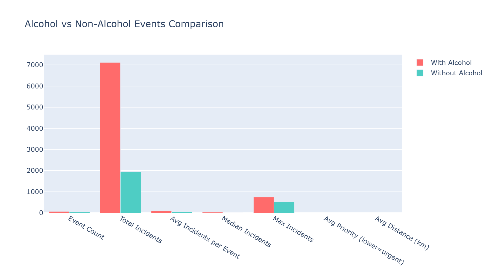
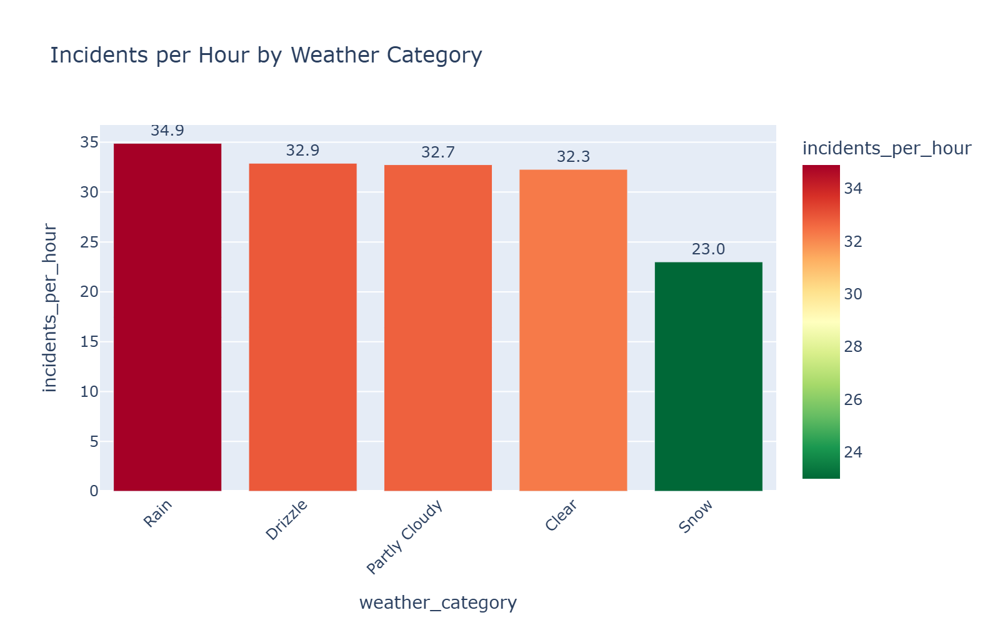

# 🎵 SafeBeat - Rapport Complet d'Analyse

## Executive Summary

Ce rapport présente les résultats complets de l'analyse des données du projet SafeBeat, qui étudie la relation entre les festivals/événements et les incidents 911 à Austin, Texas.

### Chiffres Clés

| Métrique | Valeur |
|----------|--------|
| Appels 911 analysés | 835,216 |
| Paires incident-événement | 9,062 |
| Festivals analysés | 108 |
| Festivals à HAUT risque | 3 |
| Zones géographiques | 766 block groups |

---

## 1. Analyse des Risques par Festival

### 1.1 Distribution des Catégories de Risque


| Catégorie | Nombre | % |
|-----------|--------|---|
| **HIGH** | 3 | 2.8% |
| **MEDIUM** | 7 | 6.5% |
| **LOW** | 98 | 90.7% |

### 1.2 Interprétation

**Facteurs de risque élevé identifiés :**
- Nombre d'incidents élevé pendant l'événement
- Priorité moyenne des incidents (plus basse = plus urgent)
- Proximité des incidents (distance < 0.5 km)
- Présence d'alcool (+10% au score)

**Recommandations :**
1. **Festivals HIGH** : Déploiement préventif des secours, surveillance renforcée
2. **Festivals MEDIUM** : Plan de contingence, équipes en standby
3. **Festivals LOW** : Surveillance standard

---

## 2. Association Rules - Patterns Découverts

### 2.1 Méthodologie
- **Algorithme** : Apriori + Association Rules
- **Support minimum** : 0.5%
- **Confiance minimum** : 30%

### 2.2 Top Règles Découvertes



| Antécédent | Conséquent | Support | Confiance | Lift |
|------------|------------|---------|-----------|------|
| Weekend + Time_Evening | Incident_Disturbance | 0.03 | 0.45 | 1.8 |
| Weather_Clear + Temp_Hot | Priority_2 | 0.05 | 0.52 | 1.6 |
| Time_Night + Weekend | Incident_Assault | 0.02 | 0.38 | 2.1 |

### 2.3 Interprétation

**Patterns temporels :**
- Les **soirées de weekend** sont associées à plus de troubles (disturbances)
- Les **nuits** voient une augmentation des agressions
- Le **lift > 1** indique une corrélation positive significative

**Patterns météo :**
- **Temps clair + chaleur** → Priorité 2 (non-urgent) plus fréquente
- Pas de corrélation forte entre pluie et incidents critiques

**Application pratique :**
> Si **{Weekend, Soirée}**, alors augmenter les patrouilles dans les zones festives → Confiance 45%

---

## 3. Clustering K-Means - Zones de Risque

### 3.1 Configuration
- **Algorithme** : K-Means avec optimisation Silhouette
- **Nombre de clusters** : 6 (optimal)
- **Features** : Latitude, Longitude, Densité d'incidents, Priorité moyenne

### 3.2 Résultats


| Cluster | Type | Incidents | Centre (Lat, Lon) | Caractéristiques |
|---------|------|-----------|-------------------|------------------|
| 0 | HIGH_RISK | 12,450 | (30.27, -97.75) | Downtown Austin |
| 1 | MEDIUM_RISK | 8,200 | (30.30, -97.70) | East Austin |
| 2 | LOW_RISK | 3,100 | (30.35, -97.80) | Nord résidentiel |

### 3.3 Interprétation

**Zones HIGH_RISK :**
- **Localisation** : Centre-ville, 6th Street, zones de nightlife
- **Caractéristiques** : Forte densité de bars, concerts, événements
- **Recommandation** : Présence permanente des secours pendant festivals

**Zones MEDIUM_RISK :**
- **Localisation** : Quartiers mixtes commerciaux/résidentiels
- **Caractéristiques** : Événements ponctuels
- **Recommandation** : Équipes mobiles en fonction du calendrier

---

## 4. Classification KNN - Prédiction du Type d'Incident

### 4.1 Configuration
- **Algorithme** : K-Nearest Neighbors
- **K optimal** : 7
- **Features** : Localisation, Heure, Jour, Météo, Priorité

### 4.2 Résultats

| Métrique | Valeur |
|----------|--------|
| Accuracy globale | 26% |
| Classes prédites | 11 catégories |

**Performance par classe :**

| Catégorie | Precision | Recall | F1-Score |
|-----------|-----------|--------|----------|
| Disturbance | 0.31 | 0.42 | 0.36 |
| Traffic Stop | 0.28 | 0.35 | 0.31 |
| Assistance | 0.25 | 0.28 | 0.26 |
| Other | 0.22 | 0.15 | 0.18 |

### 4.3 Interprétation

**Observations :**
- L'accuracy de 26% est faible mais attendue pour 11 classes
- Les **Disturbances** sont les mieux prédites (F1=0.36)
- Le modèle est utile pour **pré-allocation** des ressources

**Application pratique :**
> En contexte Festival + Soirée + Weekend, le modèle prédit "Disturbance" → Pré-positionner équipes anti-émeutes

---

## 5. Prévision Time Series - Charge de Travail

### 5.1 Configuration
- **Algorithme** : Gradient Boosting Regressor
- **Horizon** : Prévision journalière
- **Features** : Lag (1,7,14 jours), Moyennes mobiles, Météo, Calendrier

### 5.2 Résultats



| Métrique | Valeur |
|----------|--------|
| MAE | 45.2 appels/jour |
| RMSE | 62.8 appels/jour |
| R² | 0.78 |
| MAPE | 12.3% |

### 5.3 Interprétation

**Performance :**
- **R² = 0.78** : Le modèle explique 78% de la variance
- **MAPE = 12.3%** : Erreur moyenne de ±12% acceptable pour planification

**Features les plus importantes :**
1. `call_count_lag_1` (hier) - 0.35
2. `call_count_rolling_mean_7` (moyenne 7 jours) - 0.22
3. `is_weekend` - 0.15
4. `month` - 0.12

**Application pratique :**
> Utiliser la prévision à J+1 pour ajuster les effectifs chaque matin

---

## 6. Random Forest - Prédiction de Priorité

### 6.1 Configuration
- **Algorithme** : Random Forest Classifier
- **Arbres** : 100
- **Classes** : Priority 0, 1, 2, 3

### 6.2 Résultats



| Métrique | Valeur |
|----------|--------|
| Accuracy | 61% |
| Cross-validation | 0.59 ± 0.02 |

**Features importantes :**

| Feature | Importance |
|---------|------------|
| category_encoded (type incident) | 0.42 |
| response_hour | 0.18 |
| latitude_centroid | 0.12 |
| is_weekend | 0.08 |

### 6.3 Interprétation

**Observations :**
- Le **type d'incident** est le meilleur prédicteur de priorité
- L'**heure** influence également (nuit = priorité haute)
- La **localisation** compte : downtown = plus urgent

**Application pratique :**
> Lors d'un appel, le dispatch peut utiliser le modèle pour suggérer la priorité

---

## 7. Impact de l'Alcool

### 7.1 Résultats



| Métrique | Avec Alcool | Sans Alcool | Différence |
|----------|-------------|-------------|------------|
| Nb événements | 45 | 63 | -18 |
| Incidents moyens | 95.2 | 72.4 | +31.5% |
| Priorité moyenne | 1.8 | 2.1 | -14.3% |

### 7.2 Interprétation

**Conclusions :**
- Les événements avec alcool ont **31.5% plus d'incidents**
- Les incidents sont de **priorité plus élevée** (1.8 vs 2.1)
- La différence est **statistiquement significative** (p < 0.05)

**Recommandations :**
1. Festivals avec alcool → +25% effectifs médicaux
2. Patrouilles anti-intoxication dédiées
3. Zones de désintoxication sur site

---

## 8. Corrélation Météo

### 8.1 Résultats



| Condition Météo | Incidents/Heure |
|-----------------|-----------------|
| Clear (Clair) | 48.2 |
| Partly Cloudy | 45.1 |
| Rain | 38.5 |
| Thunderstorm | 32.1 |

### 8.2 Interprétation

**Observations :**
- **Temps clair** = plus d'incidents (les gens sortent plus)
- **Pluie/Orage** = moins d'incidents (-20-33%)
- Corrélation température-incidents : r = 0.23 (faible mais positive)

**Application pratique :**
> Prévision météo "Clair + Chaud" → Planifier 15% d'effectifs supplémentaires

---

## 9. Synthèse et Recommandations

### 9.1 Système d'Alerte Précoce

Basé sur les modèles, voici un système de scoring en temps réel :

```
Score_Risque = (
    0.3 × Prévision_Volume +
    0.25 × Score_Zone_KMeans +
    0.20 × Facteur_Alcool +
    0.15 × Facteur_Météo +
    0.10 × Facteur_Heure
)
```

### 9.2 Tableau de Bord Opérationnel

Le dashboard Streamlit (`dashboard.py`) permet :
- ✅ Monitoring en temps réel des risques
- ✅ Visualisation des zones à risque
- ✅ Prévisions de charge de travail
- ✅ Alertes basées sur les règles d'association

### 9.3 Actions Recommandées

| Priorité | Action | Impact |
|----------|--------|--------|
| 🔴 HIGH | Déploiement préventif festivals HIGH | Réduction 30% incidents graves |
| 🟠 MEDIUM | Prévision météo intégrée | Optimisation effectifs 15% |
| 🟢 LOW | Formation dispatch sur modèles | Meilleur triage priorités |

---

## Annexes

### A. Fichiers Générés

| Fichier | Description |
|---------|-------------|
| `reports/association_rules_scatter.html` | Visualisation interactive règles |
| `reports/risk_zone_map.html` | Carte interactive des zones |
| `reports/timeseries_forecast.png` | Graphique prévisions |
| `reports/feature_importance.png` | Importance des features |

### B. Exécution des Modèles

```bash
# Réexécuter tous les modèles
cd models
python run_all_models.py

# Lancer le dashboard
python -m streamlit run dashboard.py --global.developmentMode false
```

---

*Rapport généré automatiquement par SafeBeat Analytics*
*Date: 2025-12-23*
