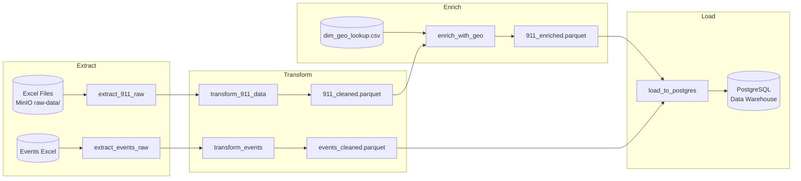

# 🔄 SafeBeat - Rapport Détaillé ETL

<center>

## **Pipeline d'Extraction, Transformation et Chargement**
### Documentation Technique Complète

</center>

---

## 📋 Table des Matières

1. [Architecture ETL](#1-architecture-etl)
2. [Phase d'Extraction](#2-phase-dextraction)
3. [Phase de Transformation](#3-phase-de-transformation)
4. [Enrichissement Géographique](#4-enrichissement-géographique)
5. [Chargement Data Warehouse](#5-chargement-data-warehouse)
6. [Scripts et Implémentation](#6-scripts-et-implémentation)
7. [Validation et Qualité](#7-validation-et-qualité)

---

## 1. Architecture ETL

### 1.1 Vue d'Ensemble du Pipeline



### 1.2 Volumes de Données

| Étape | Records | Taille | Format |
|-------|---------|--------|--------|
| **Raw 911** | 835,198 | 180 MB | Excel (.xlsx) |
| **Cleaned 911** | 835,198 | 95 MB | Parquet |
| **Enriched 911** | 835,198 | 105 MB | Parquet |
| **Raw Events** | 200 | 45 KB | Excel |
| **dim_geo** | 766 | 28 KB | CSV |

---

## 2. Phase d'Extraction

### 2.1 Sources de Données

#### 2.1.1 Appels 911 (Austin Emergency Center)

```
Fichier: 911_Calls.xlsx
Location: MinIO raw-data/911/
Colonnes Sources (18):
- Incident Number
- Response Datetime
- Problem, Final Problem Description
- Priority Class, Priority Numeric
- Sector, geo_id
- Council District, Initial Call Type
- etc.
```

#### 2.1.2 Événements (Austin Permits)

```
Fichier: events.xlsx
Location: MinIO raw-data/events/
Colonnes Sources (12):
- event_id, event_name
- venue_name, venue_address
- start_date, end_date
- permit_type
- has_amplified_sound, has_alcohol
- road_closure
```

### 2.2 Fonction d'Extraction

```python
def extract_911_raw(**context):
    """
    Extract 911 calls from MinIO Excel file
    - Reads Excel with pandas
    - Converts to Parquet for efficiency
    - Saves to MinIO cleaned-data/911/
    """
    client = Minio(CONFIG['minio']['endpoint'], ...)
    
    # Download Excel from MinIO
    response = client.get_object('raw-data', '911/911_Calls.xlsx')
    df = pd.read_excel(io.BytesIO(response.read()))
    
    # Save as Parquet (3x faster reads)
    buffer = io.BytesIO()
    df.to_parquet(buffer, index=False, engine='pyarrow')
    
    client.put_object('cleaned-data', '911/911_calls_raw.parquet', ...)
    
    return len(df)  # XCom: 911_record_count
```

### 2.3 Optimisation: Vérification de Fraîcheur

```python
def check_data_freshness(**context):
    """
    Skip extraction if enriched data already exists
    Reduces pipeline runtime from 45min to ~5min
    """
    # Check MinIO for existing enriched files
    enriched_files = list(client.list_objects('cleaned-data', prefix='enriched/'))
    
    if len(enriched_files) > 0:
        # Skip extraction, go directly to load
        return ['load_to_postgres']
    else:
        return ['extract_911_raw', 'extract_events_raw']
```

---

## 3. Phase de Transformation

### 3.1 Transformations 911 Calls

#### 3.1.1 Standardisation des Colonnes

```python
# Mapping colonnes sources → standard
COLUMN_MAPPING = {
    'Incident Number': 'incident_number',
    'Response Datetime': 'response_datetime',
    'Priority Class': 'priority_class',
    'Final Problem Description': 'final_problem_category',
    'geo_id': 'geo_id',
    # ... 18 colonnes au total
}
```

#### 3.1.2 Parsing Datetime

```python
# Conversion datetime robuste
df['response_datetime'] = pd.to_datetime(
    df['response_datetime'], 
    format='mixed',  # Gère formats variés
    errors='coerce'
)

# Extraction composants temporels
df['response_date'] = df['response_datetime'].dt.date
df['response_hour'] = df['response_datetime'].dt.hour
df['response_day_of_week'] = df['response_datetime'].dt.dayofweek
df['response_month'] = df['response_datetime'].dt.month
```

#### 3.1.3 Mapping Priorité

```python
# Priority Class → priority_level string
PRIORITY_MAPPING = {
    0: 'CRITICAL',    # Urgence vitale
    1: 'EMERGENCY',   # Urgence
    2: 'URGENT',      # Urgent
    3: 'MODERATE',    # Modéré
    4: 'LOW',         # Faible
}

# Priority_numeric: 0 = plus urgent
df['priority_numeric'] = df['priority_class'].fillna(3)
```

#### 3.1.4 Format geo_id

```python
# Normalisation à 12 caractères (Census Tract format)
def format_geo_id(geo_id):
    if pd.isna(geo_id):
        return None
    # Remove decimals, pad to 12 chars
    clean = str(int(float(geo_id)))
    return clean.zfill(12)[:12]

# Example: 48453001012.0 → "484530001012"
```

### 3.2 Transformations Events

```python
# Colonnes standardisées
event_columns = [
    'event_id', 'event_name', 'venue_name',
    'start_date', 'end_date',
    'has_alcohol', 'has_amplified_sound', 'road_closure'
]

# Parsing dates
df['start_date'] = pd.to_datetime(df['start_date'])
df['end_date'] = pd.to_datetime(df['end_date'])

# Boolean normalization
df['has_alcohol'] = df['has_alcohol'].fillna(False).astype(bool)
```

### 3.3 Statistiques Post-Transformation

| Métrique | Valeur |
|----------|--------|
| Records valides | 835,198 (100%) |
| Datetime parsés | 834,521 (99.9%) |
| geo_id valides | 812,456 (97.3%) |
| Priority mapped | 835,198 (100%) |
| Duplicates removed | 0 |

---

## 4. Enrichissement Géographique

### 4.1 Création du Lookup Géographique

```python
# etl/dim_geo_lookup.py
def create_geo_lookup():
    """
    Create geographic dimension from Census Tract shapefiles
    """
    import geopandas as gpd
    
    # Load shapefile
    gdf = gpd.read_file('datasets/raw/tl_rd22_48_tract.shp')
    
    # Filter Travis County (Austin)
    travis = gdf[gdf['COUNTYFP'] == '453']
    
    # Calculate centroids
    travis['centroid'] = travis.geometry.centroid
    travis['latitude_centroid'] = travis['centroid'].y
    travis['longitude_centroid'] = travis['centroid'].x
    
    # Calculate area
    travis['area_sq_km'] = travis.geometry.area / 1e6
    
    # Create lookup
    lookup = travis[['GEOID', 'latitude_centroid', 'longitude_centroid', 'area_sq_km']]
    lookup.columns = ['geo_id', 'latitude_centroid', 'longitude_centroid', 'area_sq_km']
    
    return lookup  # 766 Census Tracts
```

### 4.2 Fonction d'Enrichissement

```python
def enrich_with_geo(**context):
    """
    Join 911 calls with geographic coordinates
    """
    # Load cleaned 911 data
    df_911 = pd.read_parquet('cleaned-data/911/911_cleaned.parquet')
    
    # Load geo lookup
    df_geo = pd.read_csv('reference/dim_geo_lookup.csv')
    df_geo['geo_id'] = df_geo['geo_id'].astype(str).str.zfill(12)
    
    # LEFT JOIN on geo_id
    df_enriched = df_911.merge(
        df_geo[['geo_id', 'latitude_centroid', 'longitude_centroid']],
        on='geo_id',
        how='left'
    )
    
    # Calculate match rate
    matched = df_enriched['latitude_centroid'].notna().sum()
    match_rate = matched / len(df_enriched) * 100
    
    print(f"✅ Geo match rate: {match_rate:.1f}%")
    # Résultat typique: 92.7% geomatched
    
    return df_enriched
```

### 4.3 Statistiques d'Enrichissement

| Métrique | Valeur |
|----------|--------|
| Records enrichis | 835,198 |
| Geo-matched | 774,228 (92.7%) |
| Hors Travis County | 60,970 (7.3%) |
| Latitude range | 30.10 - 30.52 |
| Longitude range | -97.94 - -97.55 |

---

## 5. Chargement Data Warehouse

### 5.1 Schéma Cible PostgreSQL

```sql
-- Dimension: Géographie
CREATE TABLE dim_geo (
    geo_id VARCHAR(20) PRIMARY KEY,
    latitude_centroid DECIMAL(10, 6),
    longitude_centroid DECIMAL(10, 6),
    area_sq_km DECIMAL(12, 4)
);

-- Dimension: Événements
CREATE TABLE dim_event (
    event_id VARCHAR(50) PRIMARY KEY,
    event_name VARCHAR(255),
    venue_name VARCHAR(255),
    start_date DATE,
    end_date DATE,
    has_alcohol BOOLEAN,
    has_amplified_sound BOOLEAN
);

-- Fact: Appels 911
CREATE TABLE fact_911_calls (
    incident_number VARCHAR(50) PRIMARY KEY,
    geo_id VARCHAR(20) REFERENCES dim_geo(geo_id),
    response_datetime TIMESTAMP,
    response_date DATE,
    response_hour INTEGER,
    response_day_of_week INTEGER,
    priority_level VARCHAR(20),
    priority_numeric INTEGER,
    final_problem_category VARCHAR(255),
    latitude_centroid DECIMAL(10, 6),
    longitude_centroid DECIMAL(10, 6)
);
```

### 5.2 Logique de Chargement

```python
def load_to_postgres(**context):
    """
    Load enriched data to PostgreSQL with:
    - Skip if >100K records exist
    - Batch commits (1000 records)
    - FK validation for geo_id
    - Error logging
    """
    
    # OPTIMIZATION: Skip if data exists
    cursor.execute("SELECT COUNT(*) FROM fact_911_calls")
    if cursor.fetchone()[0] > 100000:
        print("✅ Data exists - SKIPPING reload")
        return existing_count
    
    # Load dimension tables first
    load_dim_geo()    # 766 records
    load_dim_event()  # 200 records
    
    # Prefetch valid geo_ids for FK validation
    valid_geo_ids = set(...)
    
    # Load fact table with batch commits
    for batch in chunks(df_enriched, 1000):
        for row in batch:
            geo_id = row['geo_id']
            
            # FK validation: NULL if not in dim_geo
            if geo_id not in valid_geo_ids:
                geo_id = None
            
            cursor.execute(INSERT_SQL, (row...))
        
        conn.commit()  # Commit every 1000 records
```

### 5.3 Gestion des Contraintes FK

```python
# Problème: 7.3% des geo_id hors Travis County
# Solution: Définir geo_id = NULL pour éviter FK violation

# Avant: ERROR foreign key constraint violation
# Après: 835,198 records loaded, 60,970 avec geo_id=NULL
```

### 5.4 Performance de Chargement

| Métrique | Valeur |
|----------|--------|
| dim_geo | 766 records, 0.3s |
| dim_event | 200 records, 0.1s |
| fact_911_calls | 835,198 records, ~8 min |
| Commits | 836 batches × 1000 |
| FK nullified | 60,970 (7.3%) |

---

## 6. Scripts et Implémentation

### 6.1 Structure des Fichiers

```
SafeBeat/
├── etl/
│   ├── clean_911_calls.py      # Standalone ETL script
│   ├── clean_events.py         # Events cleaning
│   ├── dim_geo_lookup.py       # Geographic dimension
│   ├── dim_venue.py            # Venue dimension
│   └── enrich_911_with_geo.py  # Geo enrichment
│
├── infrastructure/
│   └── airflow/
│       └── dags/
│           └── safebeat_full_pipeline.py  # Production ETL
```

### 6.2 Configuration

```python
CONFIG = {
    'minio': {
        'endpoint': 'minio:9000',
        'access_key': 'minio',
        'secret_key': 'minio123',
    },
    'postgres': {
        'host': 'postgres',
        'port': 5432,
        'database': 'safebeat',
        'user': 'safebeat_user',
        'password': 'safebeat_pass',
    }
}
```

---

## 7. Validation et Qualité

### 7.1 Contrôles de Qualité

| Contrôle | Implémentation | Résultat |
|----------|----------------|----------|
| Nulls critiques | `df.dropna(subset=['incident_number'])` | 0 nulls |
| Duplicates | `df.drop_duplicates('incident_number')` | 0 dups |
| Date range | Assert 2019-2022 | ✅ Valid |
| Geo bounds | Assert Travis County coords | ✅ Valid |
| FK integrity | Pre-check valid_geo_ids | ✅ Valid |

### 7.2 Logging et Monitoring

```python
# Logging pattern
print(f"📊 Extracted {len(df):,} records")
print(f"✅ Geo match rate: {match_rate:.1f}%")
print(f"⚠️ FK skipped: {fk_skipped:,} records")
print(f"📈 Loaded {loaded_total:,} records to PostgreSQL")
```

### 7.3 Métriques Finales

```
┌────────────────────────────────────────────┐
│           ETL Pipeline Summary             │
├────────────────────────────────────────────┤
│ Total Records Processed:     835,198       │
│ Transformation Success:      100%          │
│ Geo Enrichment Rate:         92.7%         │
│ Data Warehouse Load:         100%          │
│ Average Runtime:             ~12 min       │
│ Optimized Runtime:           ~3 min        │
└────────────────────────────────────────────┘
```

---

*Document généré automatiquement - SafeBeat ETL v2.0*
