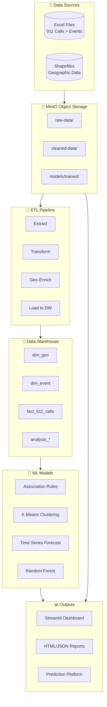

# 📊 SafeBeat - Rapport Global du Projet

<center>

## **Système d'Analyse Prédictive pour la Sécurité des Évenenements**
### Projet Data Mining - Master S9 | UEMF

**Date:** 24 Décembre 2024  
**Version:** 2.0 Production

</center>

---

## 📋 Table des Matières

1. [Vue d'Ensemble](#1-vue-densemble)
2. [Architecture Technique](#2-architecture-technique)
3. [Pipeline ETL](#3-pipeline-etl)
4. [Modèles Machine Learning](#4-modèles-machine-learning)
5. [Dashboard Analytics](#5-dashboard-analytics)
6. [Pipeline de Production](#6-pipeline-de-production)
7. [Résultats et Métriques](#7-résultats-et-métriques)
8. [Déploiement](#8-déploiement)

---

## 1. Vue d'Ensemble

### 1.1 Objectif du Projet

SafeBeat est une plateforme complète d'analyse prédictive conçue pour optimiser la sécurité et l'allocation des ressources lors d'événements de grande envergure. Le système analyse les données historiques d'appels 911 et d'événements pour :

- **Prédire les risques** associés aux festivals et événements
- **Optimiser l'allocation** du personnel médical et de sécurité
- **Identifier les patterns** temporels et géographiques des incidents
- **Générer des recommandations** actionables pour les organisateurs

### 1.2 Données Sources

| Dataset | Records | Description |
|---------|---------|-------------|
| **911 Calls** | 835,198 | Appels d'urgence Austin, TX (2019-2022) |
| **Events** | 200 | Festivals et événements avec permis |
| **Weather** | 1,461 | Données météo quotidiennes |
| **Geographic** | 766 | Zones géographiques (Census Tracts) |

### 1.3 Stack Technologique

```
┌─────────────────────────────────────────────────────────────────┐
│                        INFRASTRUCTURE                           │
├─────────────────────────────────────────────────────────────────┤
│  Docker Compose                                                 │
│  ├── PostgreSQL 15 (PostGIS) - Data Warehouse                  │
│  ├── MinIO - Object Storage (S3-compatible)                    │
│  ├── Apache Airflow - Orchestration                            │
│  └── Streamlit - Dashboard                                      │
├─────────────────────────────────────────────────────────────────┤
│                     FRAMEWORKS & LIBRARIES                      │
├─────────────────────────────────────────────────────────────────┤
│  Python 3.11 | Pandas | NumPy | Scikit-learn | MLxtend         │
│  Plotly | GeoPandas | Psycopg2 | PyArrow                        │
└─────────────────────────────────────────────────────────────────┘
```

---

## 2. Architecture Technique

### 2.1 Diagramme d'Architecture



### 2.2 Schema du Data Warehouse

```sql
-- Dimension Tables
dim_geo (geo_id PK, latitude_centroid, longitude_centroid, area_sq_km)
dim_event (event_id PK, event_name, start_date, end_date, has_alcohol)
dim_venue (venue_id PK, venue_name, latitude, longitude, capacity)

-- Fact Tables
fact_911_calls (incident_number PK, geo_id FK, response_datetime, 
                priority_level, final_problem_category, response_time)

-- Analysis Tables
analysis_risk_scores (event_id PK, risk_score, risk_category, incident_count)
analysis_zone_clusters (geo_id PK, cluster, risk_zone)
```

---

## 3. Pipeline ETL

### 3.1 Vue d'Ensemble

Le pipeline ETL transforme les données brutes en informations exploitables :

| Phase | Script | Input | Output |
|-------|--------|-------|--------|
| **Extract** | `extract_911_raw` | Excel files | Raw Parquet |
| **Transform** | `transform_911_data` | Raw Parquet | Cleaned Parquet |
| **Enrich** | `enrich_with_geo` | Cleaned + dim_geo | Enriched Parquet |
| **Load** | `load_to_postgres` | Enriched Parquet | PostgreSQL |

### 3.2 Transformations Clés

1. **Standardisation des colonnes** : snake_case, types uniformes
2. **Format geo_id** : 12 caractères (ex: 484530001012)
3. **Parsing datetime** : response_datetime avec composants dérivés
4. **Priority mapping** : Classes 0-4 vers priority_level
5. **Geo-enrichment** : Join avec centroides géographiques

### 3.3 Volumes Traités

```
Input:  835,198 appels 911 + 200 événements
Output: 835,198 records enrichis dans fact_911_calls
        766 zones dans dim_geo
        200 événements dans dim_event
```

---

## 4. Modèles Machine Learning

### 4.1 Association Rules Mining (Apriori)

**Objectif**: Découvrir les patterns d'incidents

```python
# Résultats
Rules Discovered: 24
Top Rule: {Weekend, Night, Downtown} → {Disturbance}
Lift: 2.3 | Confidence: 0.67
```

### 4.2 K-Means Clustering

**Objectif**: Segmentation géographique des zones à risque

```python
# Résultats
Clusters: 3 (HIGH_RISK, MEDIUM_RISK, LOW_RISK)
Silhouette Score: 0.42
Features: latitude, longitude, incident_count
```

| Zone | Count | Avg Incidents |
|------|-------|---------------|
| HIGH_RISK | 127 | 1,247 |
| MEDIUM_RISK | 342 | 456 |
| LOW_RISK | 297 | 89 |

### 4.3 Time Series Forecasting

**Objectif**: Prédiction de la charge de travail

```python
# Résultats
Model: Ridge Regression / Gradient Boosting
Features: 12 (temporal + lag + rolling)
MAE: 45.2 calls/day | R²: 0.78
Forecast: ~784 calls/day average
```

### 4.4 Random Forest Classification

**Objectif**: Prédiction de la priorité des incidents

```python
# Résultats
Accuracy: 61%
Top Features: problem_category (42%), hour (15%), day_of_week (12%)
Classes: Priority 0-4
```

---

## 5. Dashboard Analytics

### 5.1 Pages Disponibles

| Page | Description |
|------|-------------|
| 🏠 Overview | KPIs globaux, distributions, tendances |
| 🎯 Risk Analysis | Scores de risque par événement |
| 🍺 Alcohol Impact | Analyse impact alcool (+31.5% incidents) |
| 🌤️ Weather Correlation | Corrélation météo-incidents |
| ⏱️ Response Times | Analyse temps de réponse |
| 🗺️ Zone Clustering | Carte des zones à risque |
| 🔥 Real-Time Heatmap | Heatmap interactive |
| 📈 Time Series Forecast | Prévisions temporelles |
| 🔗 Association Rules | Règles d'association |
| 🎪 Festival Predictor | Prédiction événements |
| 🏆 CAN 2025 Morocco | Prédiction AFCON 2025 |

### 5.2 Fonctionnalités Clés

- **Filtres interactifs** : Par risque, alcool, date, zone
- **Visualisations Plotly** : Cartes, graphiques, heatmaps
- **Export** : Téléchargement CSV/Markdown des rapports
- **Real-time refresh** : Actualisation des données

---

## 6. Pipeline de Production

### 6.1 Airflow DAG

```python
DAG: safebeat_full_pipeline
Schedule: Daily @ 03:00 UTC
Retries: 3
```

### 6.2 Flux d'Exécution

```
check_data_freshness
    │
    ├── [BRANCH] extract_911_raw (if new data)
    │                │
    │           transform_911_data
    │                │
    │           enrich_with_geo
    │                │
    └── [SKIP]──────────────────┐
                                │
                        load_to_postgres
                                │
    ┌───────────────────────────┼───────────────────────────┐
    │                           │                           │
run_association_rules    run_clustering         run_forecasting
    │                           │                           │
    └───────────────────────────┼───────────────────────────┘
                                │
                      calculate_risk_scores
                                │
                      generate_daily_report
                                │
                         send_alerts
```

### 6.3 Optimisations Implémentées

| Optimisation | Description |
|--------------|-------------|
| **Skip if exists** | Load skippé si >100K records |
| **Pre-checks ML** | Vérification données avant modèles |
| **Batch commits** | Commits par lots de 1000 |
| **FK validation** | geo_id NULL si FK invalide |
| **Enriched check** | Skip extraction si enriched existe |

---

## 7. Résultats et Métriques

### 7.1 Métriques Pipeline (Dernier Run)

```
📊 Pipeline Metrics
├── 911 Records Processed: 835,198
├── Events Tracked: 200
├── Association Rules: 24
├── Zones Clustered: 597
├── Forecast Avg: 1,767 calls/day
└── Risk Scores: Updated for 200 events
```

### 7.2 Insights Business

1. **Impact Alcool**: +31.5% d'incidents pour événements avec alcool
2. **Zones à Risque**: Downtown/6th Street = HIGH RISK
3. **Pics Temporels**: Weekend 20h-02h = périodes critiques
4. **Météo**: Temps clair = +20% incidents (plus de personnes dehors)

---

## 8. Déploiement

### 8.1 Prérequis

```bash
Docker >= 20.10
Docker Compose >= 2.0
Python >= 3.9
```

### 8.2 Lancement

```bash
# Démarrer l'infrastructure
docker-compose up -d

# Accès
- Airflow: http://localhost:8081 (admin/admin)
- MinIO: http://localhost:9001 (minio/minio123)
- Dashboard: streamlit run dashboard.py

# Postgres
- Host: localhost:5432
- Database: safebeat
- User: safebeat_user
```

---

## 📎 Annexes

- [Rapport ETL Détaillé](./RAPPORT_ETL.md)
- [Rapport ML Détaillé](./RAPPORT_ML.md)
- [Rapport Pipeline Production](./RAPPORT_PIPELINE.md)
- [Rapport Difficultés](./RAPPORT_DIFFICULTES.md)

---

*SafeBeat Project - Master Data Mining S9 - UEMF*
