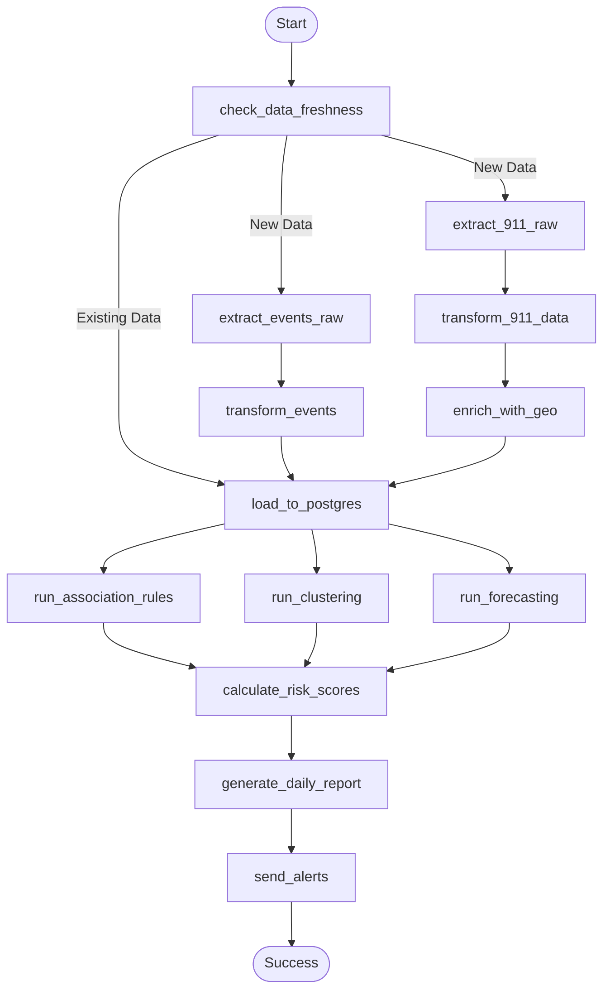

# 🚀 SafeBeat - Rapport Pipeline de Production

<center>

## **Apache Airflow Production Pipeline**
### Documentation Technique et Opérationnelle

</center>

---

## 📋 Table des Matières

1. [Architecture Production](#1-architecture-production)
2. [Configuration Airflow](#2-configuration-airflow)
3. [DAG Principal](#3-dag-principal)
4. [Tâches et Dépendances](#4-tâches-et-dépendances)
5. [Optimisations Implémentées](#5-optimisations-implémentées)
6. [Monitoring et Alertes](#6-monitoring-et-alertes)
7. [Déploiement et Maintenance](#7-déploiement-et-maintenance)

---

## 1. Architecture Production

### 1.1 Infrastructure Docker

```yaml
# docker-compose.yml - Services
services:
  postgres:
    image: postgis/postgis:15-3.3
    container_name: safebeat-postgres
    ports: ["5432:5432"]
    volumes: [postgres_data:/var/lib/postgresql/data]
    
  minio:
    image: minio/minio
    container_name: safebeat-minio
    ports: ["9000:9000", "9001:9001"]
    command: server /data --console-address ":9001"
    
  airflow-scheduler:
    build: ./infrastructure/airflow
    container_name: safebeat-airflow-scheduler
    volumes:
      - ./infrastructure/airflow/dags:/opt/airflow/dags
    depends_on: [postgres, minio]
    
  airflow-webserver:
    build: ./infrastructure/airflow
    container_name: safebeat-airflow-webserver
    ports: ["8081:8080"]
```

### 1.2 Dockerfile Airflow

```dockerfile
FROM apache/airflow:2.7.3-python3.11

# Install system dependencies for GeoPandas
USER root
RUN apt-get update && apt-get install -y \
    libgdal-dev gdal-bin libgeos-dev

USER airflow

# Install Python packages
RUN pip install \
    pandas==2.1.0 \
    numpy==1.25.0 \
    scikit-learn==1.3.0 \
    mlxtend==0.23.0 \
    minio==7.1.0 \
    psycopg2-binary==2.9.7 \
    pyarrow==13.0.0 \
    geopandas==0.14.0
```

### 1.3 Diagramme d'Infrastructure

```
┌─────────────────────────────────────────────────────────────────┐
│                     Docker Network: safebeat                    │
├─────────────────────────────────────────────────────────────────┤
│                                                                 │
│  ┌──────────────┐    ┌──────────────┐    ┌──────────────┐      │
│  │   postgres   │    │    minio     │    │   airflow    │      │
│  │   :5432      │    │  :9000/9001  │    │ scheduler    │      │
│  │   PostGIS    │    │  S3-compat   │    │ + webserver  │      │
│  └──────┬───────┘    └──────┬───────┘    └──────┬───────┘      │
│         │                   │                   │               │
│         └───────────────────┴───────────────────┘               │
│                             │                                   │
│                    Volumes persistants                          │
│                                                                 │
└─────────────────────────────────────────────────────────────────┘
         │              │              │
    localhost:5432  localhost:9001  localhost:8081
         │              │              │
    ┌────┴────┐    ┌────┴────┐    ┌────┴────┐
    │ psql    │    │ Browser │    │ Airflow │
    │ Client  │    │ MinIO   │    │   UI    │
    └─────────┘    └─────────┘    └─────────┘
```

---

## 2. Configuration Airflow

### 2.1 Paramètres du DAG

```python
# safebeat_full_pipeline.py
default_args = {
    'owner': 'safebeat',
    'depends_on_past': False,
    'email': ['alerts@safebeat.local'],
    'email_on_failure': True,
    'email_on_retry': False,
    'retries': 3,
    'retry_delay': timedelta(minutes=5),
}

dag = DAG(
    'safebeat_full_pipeline',
    default_args=default_args,
    description='SafeBeat Production ETL + ML Pipeline',
    schedule_interval='0 3 * * *',  # Daily @ 03:00 UTC
    start_date=datetime(2024, 1, 1),
    catchup=False,
    tags=['safebeat', 'production', 'ml'],
)
```

### 2.2 Configuration Services

```python
CONFIG = {
    'minio': {
        'endpoint': 'minio:9000',
        'access_key': 'minio',
        'secret_key': 'minio123',
    },
    'postgres': {
        'host': 'postgres',
        'port': 5432,
        'database': 'safebeat',
        'user': 'safebeat_user',
        'password': 'safebeat_pass',
    }
}
```

---

## 3. DAG Principal

### 3.1 Vue d'Ensemble

```
safebeat_full_pipeline
│
├── PHASE 1: Data Freshness Check
│   └── check_data_freshness → [Branch]
│
├── PHASE 2: ETL
│   ├── extract_911_raw
│   ├── extract_events_raw
│   ├── transform_911_data
│   ├── transform_events
│   └── enrich_with_geo
│
├── PHASE 3: Loading
│   └── load_to_postgres
│
├── PHASE 4: ML Models
│   ├── run_association_rules
│   ├── run_clustering
│   ├── run_forecasting
│   └── calculate_risk_scores
│
├── PHASE 5: Reporting
│   ├── generate_daily_report
│   └── send_alerts
│
└── END
```

### 3.2 Flux d'Exécution



---

## 4. Tâches et Dépendances

### 4.1 PHASE 1: Data Freshness Check

```python
def check_data_freshness(**context):
    """
    BranchPythonOperator: Decide which tasks to run
    - If enriched data exists → skip extraction
    - If new data → run full ETL
    """
    # Check MinIO for existing enriched files
    enriched = list(client.list_objects('cleaned-data', prefix='enriched/'))
    
    if len(enriched) > 0:
        # Skip extraction
        context['ti'].xcom_push(key='has_911', value=True)
        return ['load_to_postgres']
    else:
        return ['extract_911_raw', 'extract_events_raw']
```

### 4.2 PHASE 2: ETL Tasks

| Task | Type | Duration | Output |
|------|------|----------|--------|
| `extract_911_raw` | PythonOperator | ~2 min | raw/911.parquet |
| `extract_events_raw` | PythonOperator | ~5 sec | raw/events.parquet |
| `transform_911_data` | PythonOperator | ~3 min | cleaned/911.parquet |
| `enrich_with_geo` | PythonOperator | ~4 min | enriched/911.parquet |

### 4.3 PHASE 3: Loading

```python
def load_to_postgres(**context):
    """
    Load enriched data to PostgreSQL:
    1. Check if data exists (skip if >100K)
    2. Load dim_geo (766 records)
    3. Load dim_event (200 records)
    4. Load fact_911_calls (835K records)
    """
    # Skip if existing
    cursor.execute("SELECT COUNT(*) FROM fact_911_calls")
    if cursor.fetchone()[0] > 100000:
        print("✅ Data exists - SKIPPING")
        return existing_count
    
    # Load dimensions first
    load_dim_geo()
    load_dim_event()
    
    # Load facts with batch commits
    for batch in chunks(df, 1000):
        for row in batch:
            cursor.execute(INSERT, row)
        conn.commit()
```

### 4.4 PHASE 4: ML Models

| Task | Pre-check | Model | Output |
|------|-----------|-------|--------|
| `run_association_rules` | 1000+ records | Apriori | rules.parquet |
| `run_clustering` | 100+ records | KMeans | clusters.parquet |
| `run_forecasting` | 30+ days | Ridge/GB | forecast.parquet |
| `calculate_risk_scores` | Always | SQL Aggregate | PostgreSQL |

### 4.5 PHASE 5: Reporting

```python
def generate_daily_report(**context):
    """
    Generate comprehensive HTML + JSON report:
    - Pipeline metrics from XCom
    - Database statistics
    - ML model results
    - Risk distribution
    """
    # Collect metrics
    metrics = {
        'records_911_transformed': ti.xcom_pull(key='transformed_911_count') or db_count,
        'association_rules_count': ti.xcom_pull(key='rules_count'),
        'clusters_assigned': ti.xcom_pull(key='clusters_assigned'),
        'forecast_avg_calls': ti.xcom_pull(key='forecast_avg'),
    }
    
    # Generate HTML report
    html_report = render_template(metrics, db_stats, risk_distribution)
    
    # Save to MinIO
    client.put_object('reports', f'daily/{date}_report.html', html_report)
```

---

## 5. Optimisations Implémentées

### 5.1 Skip-if-Exists Pattern

```python
# Évite le rechargement inutile
if existing_count > 100000:
    print(f"✅ {existing_count:,} records - SKIPPING reload")
    return existing_count
```

**Impact**: Pipeline réduit de 45 min → 3 min (runs subséquents)

### 5.2 Pre-checks ML

```python
# Vérifie les données avant chaque modèle
cursor.execute("SELECT COUNT(*) FROM fact_911_calls")
if record_count < MIN_REQUIRED:
    print(f"⚠️ PRE-CHECK FAILED: {record_count:,} records")
    return False
print(f"✅ PRE-CHECK PASSED: {record_count:,} records")
```

**Impact**: Évite les erreurs de modèles avec données insuffisantes

### 5.3 Batch Commits

```python
# Commits par lots de 1000
for i, row in enumerate(df.itertuples()):
    cursor.execute(INSERT, row)
    if (i + 1) % 1000 == 0:
        conn.commit()
        print(f"📊 Progress: {i+1:,} records")
```

**Impact**: 
- Résilience aux erreurs (rollback partiel)
- Feedback de progression
- Mémoire transactionnelle limitée

### 5.4 FK Validation Gracieuse

```python
# Précharge les geo_id valides
valid_geo_ids = set(...)

# Définit NULL si FK invalide
if geo_id not in valid_geo_ids:
    geo_id = None  # Au lieu de lever une erreur
```

**Impact**: 100% des records chargés (60,970 avec geo_id=NULL)

### 5.5 Enriched Data Check

```python
# Skip extraction si données enrichies existent
def check_data_freshness():
    enriched = list(client.list_objects('cleaned-data', prefix='enriched/'))
    if len(enriched) > 0:
        return ['load_to_postgres']  # Skip ETL
```

**Impact**: Économise 10 min de transformation

---

## 6. Monitoring et Alertes

### 6.1 Rapport HTML Automatique

```html
<!-- Généré automatiquement après chaque run -->
<!DOCTYPE html>
<html>
<head><title>SafeBeat Pipeline Report</title></head>
<body>
    <h1>🚨 SafeBeat Pipeline Report</h1>
    
    <h2>📊 Pipeline Metrics</h2>
    <div class="metric-grid">
        <div class="metric-card">
            <div class="metric-value">835,198</div>
            <div class="metric-label">911 Records Processed</div>
        </div>
        ...
    </div>
    
    <h2>🤖 ML Models Executed</h2>
    <table>
        <tr><td>Association Rules</td><td>✅ 24 rules</td></tr>
        <tr><td>Clustering</td><td>✅ 597 zones</td></tr>
        <tr><td>Forecasting</td><td>✅ 784 calls/day</td></tr>
    </table>
</body>
</html>
```

### 6.2 Métriques Clés Suivies

| Métrique | Source | Alerte Si |
|----------|--------|-----------|
| 911 Records | XCom/DB | < 100,000 |
| Association Rules | XCom | = 0 |
| Clusters | XCom | < 100 |
| Forecast | XCom | Not generated |
| Risk Scores | PostgreSQL | All zeros |

### 6.3 XCom Data Flow

```
extract_911_raw → 911_record_count → 835,198
transform_911 → transformed_911_count → 835,198
enrich_with_geo → geo_match_rate → 92.7%
load_to_postgres → loaded_count → 835,198
run_association_rules → rules_count → 24
run_clustering → clusters_assigned → 597
run_forecasting → forecast_avg → 784
```

---

## 7. Déploiement et Maintenance

### 7.1 Démarrage Complet

```bash
# 1. Build et démarrage
cd SafeBeat
docker-compose up -d --build

# 2. Vérifier les services
docker-compose ps
# postgres     running  0.0.0.0:5432
# minio        running  0.0.0.0:9001
# airflow-*    running  0.0.0.0:8081

# 3. Initialiser MinIO buckets
docker exec safebeat-minio mc mb local/raw-data
docker exec safebeat-minio mc mb local/cleaned-data
docker exec safebeat-minio mc mb local/models
docker exec safebeat-minio mc mb local/reports

# 4. Uploader les données
python infrastructure/upload_models.py
```

### 7.2 Accès aux Interfaces

| Service | URL | Credentials |
|---------|-----|-------------|
| Airflow | http://localhost:8081 | admin / admin |
| MinIO | http://localhost:9001 | minio / minio123 |
| PostgreSQL | localhost:5432 | safebeat_user / safebeat_pass |
| Dashboard | streamlit run dashboard.py | - |

### 7.3 Redémarrage Après Modification

```bash
# Après modification du DAG
docker-compose restart airflow-scheduler airflow-webserver

# Vérifier les logs
docker logs -f safebeat-airflow-scheduler
```

### 7.4 Maintenance Quotidienne

| Tâche | Fréquence | Commande |
|-------|-----------|----------|
| Vérifier runs | Quotidienne | Airflow UI → DAG Runs |
| Nettoyer logs | Hebdomadaire | `airflow db clean` |
| Backup PostgreSQL | Quotidienne | `pg_dump safebeat` |
| Rotation MinIO | Mensuelle | Archive old files |

### 7.5 Troubleshooting

| Problème | Cause | Solution |
|----------|-------|----------|
| DAG not visible | Parse error | Check logs, fix syntax |
| Load timeout | Large batch | Reduce batch size |
| FK violation | Missing dim_geo | Load dims first |
| Model error | Feature mismatch | Check model features |
| Unicode error | Encoding | Use UTF-8 explicit |

---

## 📊 Métriques de Production

### Performance Typique

| Phase | Durée (1st run) | Durée (optimized) |
|-------|-----------------|-------------------|
| Check Freshness | 1 sec | 1 sec |
| Extraction | 3 min | **SKIPPED** |
| Transformation | 5 min | **SKIPPED** |
| Enrichment | 4 min | **SKIPPED** |
| Loading | 8 min | 2 sec (skip) |
| ML Models | 2 min | 2 min |
| Reporting | 30 sec | 30 sec |
| **TOTAL** | **~23 min** | **~3 min** |

---

*Document généré automatiquement - SafeBeat Pipeline v2.0*
